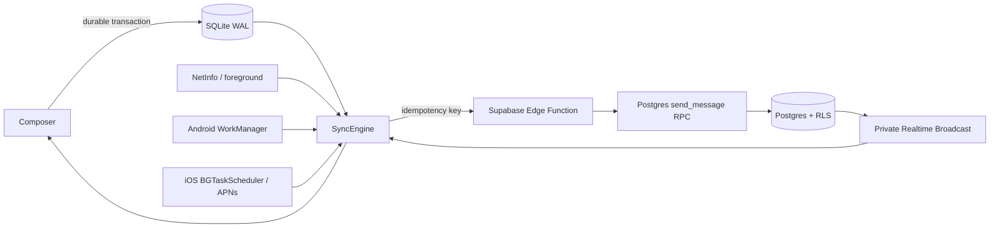

# Quack architecture

## Source of truth

SQLite is the local source of truth. A message is inserted into `messages` and `outbox` in one transaction before the composer clears. The outbox is durable across app restarts, process death, and reboot. Supabase is the server source of truth and deduplicates every send by client-generated UUID.

## Sync flow



## Queue rules

- User sends have priority 100; retries preserve original ordering within a conversation.
- Only one SQLite lease may own a sync run; leases expire after 45 seconds.
- At most four requests run concurrently, with one active request per conversation.
- Transient errors use exponential backoff with jitter, capped at 15 minutes. Twelve automatic attempts halt the item for manual retry.
- Terminal records are compacted after 30 days. Unsent records are never evicted; new media is rejected when the 50 MB outbox cap is reached.

## Background limitations

Android WorkManager persists work through app restarts and device reboots but remains subject to Doze, OEM battery policies, and user force-stop. iOS refresh and silent push are opportunistic; the system can defer or drop them, and force-quit prevents reliable background relaunch. The user always sees the locally persisted message and the next foreground launch drains the queue.

## Build commands

```bash
npm install
npx pod-install
npx react-native start
npx react-native run-android
npx react-native run-ios
```

For Supabase, copy `.env.example` to `.env`, apply `supabase/migrations/0001_initial.sql`, deploy `supabase/functions/sync`, and configure APNs/FCM secrets outside the repository. `react-native-config` injects the two publishable values into native builds; rebuild after changing `.env`. CI or hosted builds may instead define `globalThis.__QUACK_CONFIG__` before the app bundle initializes. Only the publishable Supabase key belongs in the app; service-role keys stay in Edge Function secrets.
